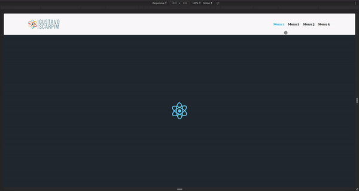

# Menu responsivo

## <a href="http://menu-responsivo.netlify.app/"> Ver exemplo </a>

## Descrição

Esse projeto foi desenvolvido para mostrar uma forma simples e fácil de criar um menu hamburger que fica compatível com todos os tipos de resuluções:

## Linguagens e ferramentas utilizadas

* React
* Typescript
* Styled Components

## Para inicializar o projeto na sua máquina local.

<b>1º Clone esse repositório no seu computador ou baixe no formato (ZIP).</b>

<b>2º Abra o seu terminal e na raiz do projeto rode o comando `npm install` ou `yarn` para baixar todas as depêndencias do projeto.</b>

<b>3º Rode o comando "yarn start" ou "npm start".</b>

# Desenvolvido por Gustavo Scarpim:

## Desktop

